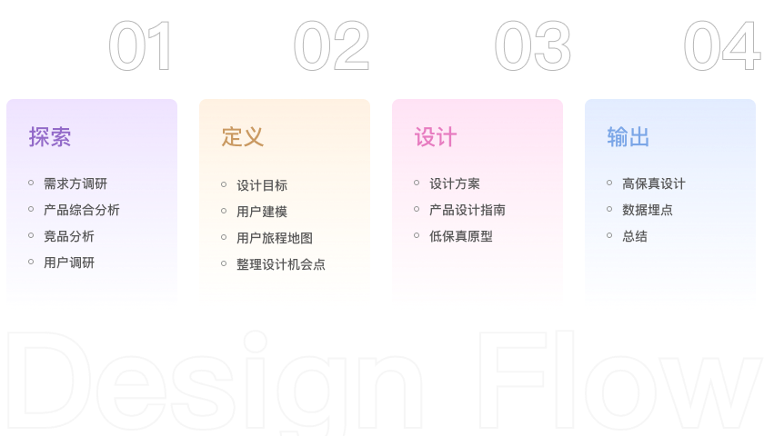
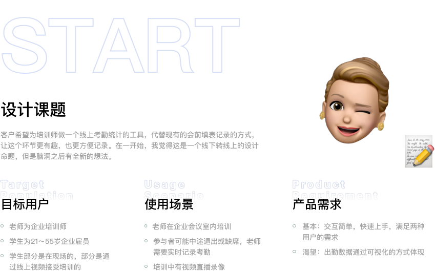
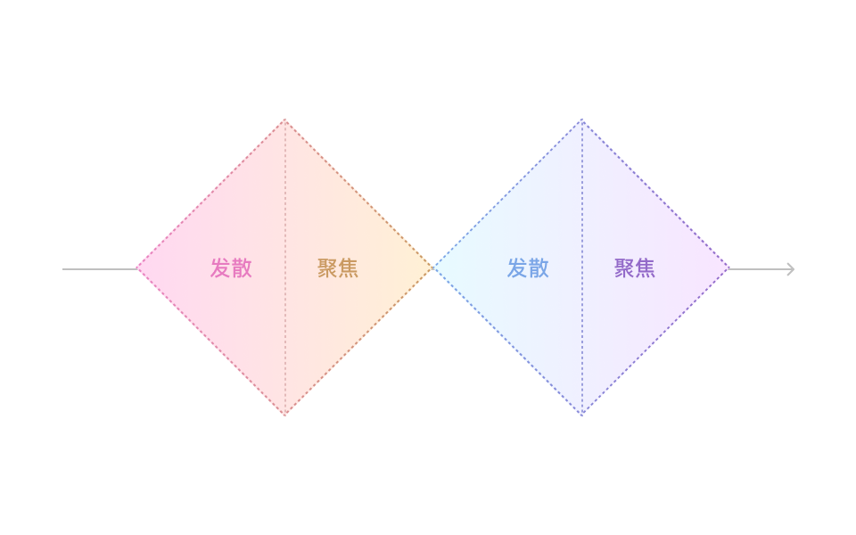
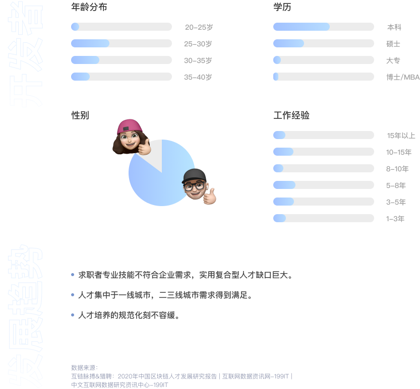
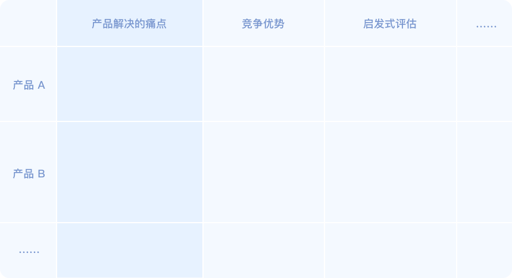

理想化下（没有外部因素压制）设计一个功能或者是产品的流程。 
这个流程通常也可以运用于独立完成一个项目或者设计测试题。 
设计思维是我的工具箱，设计流程是一套组合拳，要想致命就要选好组合。 

### 1. 课题解析
在进入设计流程之前我会解析课题（我把所有难题都叫课题），然后把所有已知的信息组织成一个简单的开篇。

### 2. 设计流程
项目需要从什么环节开始什么环节结束？设计的目的是什么？

**设计任务通常有以下几种情况：**

1. 从0开始设计一款产品的设计方案，产出UI方案给团队进行评审。
2. 优化现有的产品，产出一个具体可以实践的方案。
3. 为设计团队制定一个设计规范文档。

为不同的情况安排具体的设计思路，这里分享一个**双钻模型**，这个模型时不时会拿出来看一下。

### 3. 数据报告
任何一个产品都需要针对当下目标用户群和痛点，进行组合性的行业分析，这里举个例子：
> 测试题中说需要你来为00后设计一个视频社交的移动产品。
那我们需要去找最近2年内关于「00后、视频、社交、移动应用」的数据报告。

#### 二手数据

- [199it](http://www.199it.com)
- [艾瑞咨询](https://www.iresearch.com.cn)
- [CTR](http://www.ctrchina.cn)
- [蝉大师](https://www.chandashi.com)

洞察数据的能力怎么学习？ 
多看多想，同时可以结合一些第三方媒体文章来看，教育类的公众号比如：「多鲸」、「Edu指南」，如果有线下会展，也可以选择自己感兴趣的行业去参加旁听。 
通常我会整理出目标用户的一些数据，**可视化**它们，方便团队内成员参考。

#### 一手数据

这里指的是用户调研或者现有产品的后台数据，这些都是真实可靠的一手资源，虽然前人的调研报告直接拿来很方便，但还是建议自己做一些工作，一方面是接触和了解用户是什么样的，另一方面也可以通过修改调研提纲来获得更加贴近课题的数据。

### 4. 竞品分析
公司内，可以直接向产品经理、领导或需求方请求一个竞品列表，有些团队会长期更新一个竞品列表，竞品分「直接/间接/潜在」三种类型，类似的表格其实网上一搜一大堆。  
我会选取一部分比较核心的列举在我的产品文档中。 
**产品解决了的痛点 / 竞争优势 / 启发式评估**

