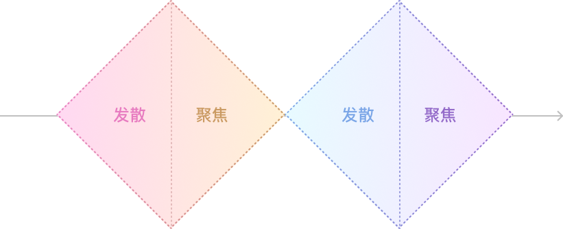
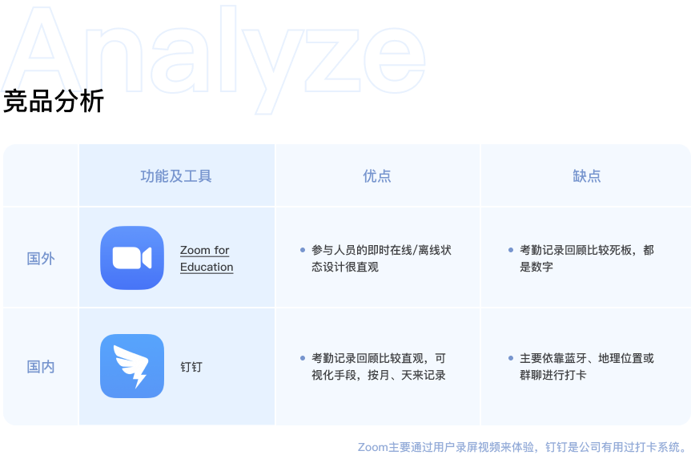

野路子和大厂流水线的设计流程不分好坏，只有适不适合。 
这里只分享适合鄙人的方法，毕竟我一直单打独斗好多年，不沉淀点东西说不过去。 
这个流程通常也可以运用于独立完成一个项目或者设计测试题。 
> 设计思维是我的工具箱，设计流程是一套组合拳，要想致命就要选好组合。 

### 1. 课题解析

在进入设计流程之前我会解析课题（我把所有难题都叫课题），然后把所有已知的信息组织成一个简单的开篇。 
用**What、who、where、when、how**来解析课题。 

### 2. 设计「流程」

项目需要从什么环节开始什么环节结束？ 设计的目的是什么？

**设计任务通常有以下几种情况：**

1. 从0开始设计一款产品的设计方案，产出UI方案给团队进行评审。
2. 优化现有的产品，产出一个具体可以实践的方案。
3. 为设计团队制定一个设计规范文档。

为不同的情况安排具体的设计思路，这里分享一个**双钻模型**，这个模型时不时会拿出来看一下。

### 3. 数据报告

任何一个产品都需要针对当下目标用户群和痛点，进行组合性的行业分析，这里举个例子：
> 测试题中说需要你来为00后设计一个视频社交的移动产品。
那我们需要去找最近2年内关于「00后、视频、社交、移动应用」的数据报告。

#### 一手数据

这里指的是用户调研或者现有产品的后台数据，这些都是真实可靠的一手资源，虽然前人的调研报告直接拿来很方便，但还是建议自己做一些工作，自己通过原始数据去了解用户是什么样的，另一方面也可以通过修改调研提纲来获得更加贴近课题的数据。

#### 二手数据

- [199it](http://www.199it.com)
- [艾瑞咨询](https://www.iresearch.com.cn)
- [CTR](http://www.ctrchina.cn)
- [蝉大师](https://www.chandashi.com)

#### 培养洞察力

洞察数据的能力怎么培养和强化？ 
多看多想，同时可以结合一些第三方媒体文章来看。 
教育类的公众号比如：「多鲸」、「Edu指南」，如果有线下会展，也可以选择感兴趣的去参加旁听。 
通常我会整理出目标用户的一些数据，**可视化**它们，方便团队内成员参考。

### 4. 竞品分析

公司内，可以直接向产品经理、领导或需求方请求一个竞品列表，有些团队会长期更新一个竞品列表，竞品分「直接/间接/潜在」三种类型，类似的表格其实网上一搜一大堆。  
我会选取一部分比较核心的列举在我的产品文档中。 
**产品解决了的痛点 / 竞争优势 / 启发式评估**

#### 产出行业报告

一段时间的桌面研究后，可以将自己对行业和目标用户的了解结合在一起，产出一份**受众为所有人**的规范报告。 
曾经我的大学老师给我发了这样一段话： 

> 我很期待看你写的，在那么多同学中，你是最理性的人，好好消化，不是滥用或照搬那些文字，而是自己消化之后，对他们理解后，**用自己的思路去阐述**
> 而且，重要的并不是别人怎么看或是书上怎么评价，我想看到的是，你怎么看，有好有坏。

### 5. 用户调研

重中之重的一个环节就是用户调研，每次调研我都又紧张又激动又期待，我和用户又贴近一些距离，我离真相又近了一步，即使是做给自己用的产品，也不要漏了这一步，自问自答也好过拍脑袋的需求。

#### 群组优先级

当目标用户群有2种以上时，需要对用户组进行优先级筛选，这时可以倒退回去重新整理数据报告，也可以为后面的用户分组做铺垫。

#### 大胆假设

用户调研我会从大胆假设开始，然后一步步小心求证。

1. 初步假设用户的分类，记录好自己分类的依据和思考过程。
2. 自我代入不同的用户角色后，想象自己在具体的场景下会看到、听到和想到什么东西。

#### 定性调研和定量调研

基础性的理论不具体展开说，我们可以在定性调研中获取接下去的设计灵感，在定量调研中确认自己的方向没有走偏。

#### 设计用户画像

为每一个用户分类设计一个鲜活具体的角色形象，我偷懒的做法是直接找一个最有代表性的用户，将他的信息脱敏处理好之后设计成用户画像。 
用户画像对整个项目有重要的作用，当我在写需求做交互画视觉的时候，我会觉得我在为**具体的人**服务，而不是在为我自己，这个很重要。 
产品设计师不应该只为了表现自己，或将喜好强加于他人。 

#### 用户故事

不管是用户体验地图还是同理心地图，要体现的都是用户的感受，使用什么工具取决于你的产品目标和定位。 

最基础的东西少不了，模拟或记录一个用户从被服务前到服务后的全过程，其中不同环节中的**用户痛点**（让他情绪变糟的事件）以及**机会点**（可能会让用户情绪180度转变或心情更好印象更深的事件）。

